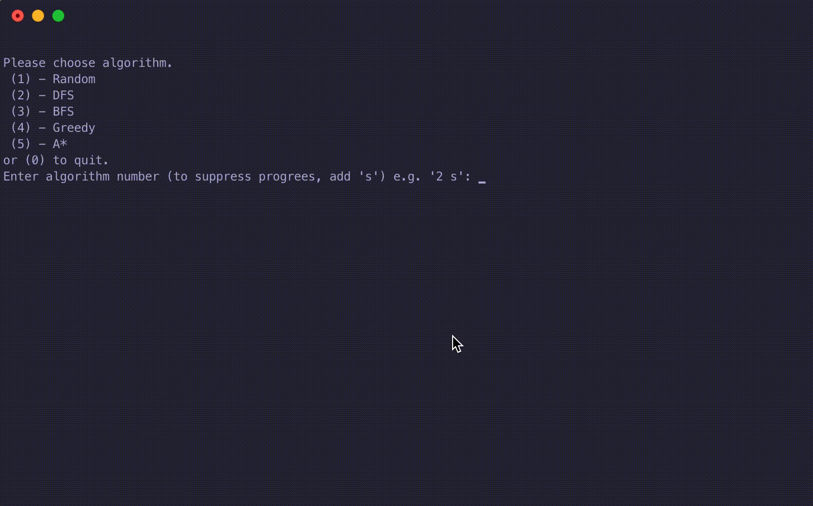
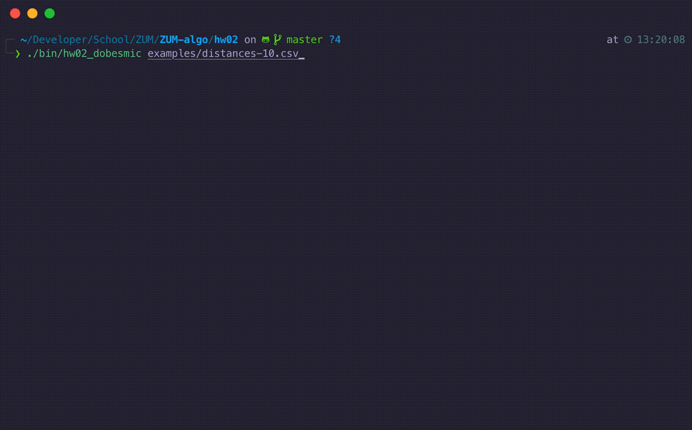

# Algorithms for searching the state space (BI-ZUM)

This repository was created as a part of my 'The basics of artificial intelligence' course at FIT CTU. The repository contains C++ code with implementation of algorithms for both systematic and non-systemating search of the state space.

## Prerequisites 
- C++ compiler (g++)
- Make

Compile by running `make` in the subproject folder. A binary will be created in *bin* folder.

## Subprojects

---

### hw01 - Systematic state space search

Maze solver, loads a specified maze from a text file, allows the selection of a algorithm used to find the solution and displays an animation of its progress in the terminal.

#### Maze loading
The binary takes a path to this maze file as an argument. The format of a maze is as follows:
- ` ` (space) - empty tile
- `X` - wall
  
Start and goal tiles are specified using coordinates below the maze in the format `start x, y` and `end x, y`.
For example maze, see *./hw01/examples* directory.

#### Algorithm selection
After loading the maze, the solver offers a selection of algorithms to use for solving the maze:
- Random search
- Depth-first search (DFS)
- Breadth-first search (BFS)
- Greedy search
- A*

#### Maze animation
The solver displays an animation of the algorithm's progress in terminal, with highlighted opened and closed tiles.

---

### hw02 - Non-systematic state space search

[Travelling salesman problem](https://en.wikipedia.org/wiki/Travelling_salesman_problem) solver using the hill-climbing algorithm.

The solver loads specified TSP problem from a CSV file and approximates a solution while displaying its progress.

#### Problem loading
The binary takes a path to the problem CSV file as an argument. The format of the problem is CSV, structured as follows:

`city,distances` for each row

where city is a name of a city and distances is a comma-separated list of distances from this city to all the other cities in the same order as the cities are in the rows. For example TSP problem, see *./hw02/examples* directory.

